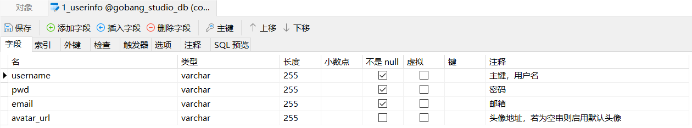
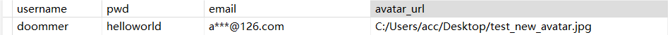

# Cpp-course-design

Cpp course design of NEU 东北大学计院cpp课程设计-五子棋(GoBang, Gomoku)

## 1. Project Overview

### 1.1 Project Description

This project utilizes C++ knowledge along with the Qt framework and some self-expanded new knowledge to implement a complete Gobang (Five in a Row) game system. The goal of this project is to gain a deeper understanding and mastery of C++ and showcase it in a program, while also developing programming thinking and skills, expanding knowledge, and learning some content not covered in class. Additionally, by reading a certain amount of code written by others, it aims to improve the ability to read and understand other people's ideas and approaches, thereby enhancing programming skills.

**Main Features:**
1. Implement login, register new account, recover password, game directory, Gobang game tutorial, account settings, "Practice Mode", "Two-player Mode", and "Human vs AI Mode" pages.
2. Implement Gobang game logic, and based on game logic and understanding, use dynamic programming concepts to implement a dual-optimized Alpha-Beta pruning algorithm for position evaluation and human vs AI mode, involving AC automaton and Zobrist hashing.
3. Use file interface to implement save and import of game records. When the player closes the interface without saving the current game, a prompt will appear to prevent accidental closures.
4. Different modes have corresponding "Undo" functions. All modes have "Restart", display move list, display specified number of moves, and replay functions. In practice mode, arbitrary game variations can be generated, and the position score can be displayed in tables and energy bars, making it intuitive and convenient.
5. Implement database storage of user registration information, including username, password, email, and avatar URL information, using linked lists as temporary storage units.
6. Use TCP protocol to send verification codes during registration and passwords during password recovery. These two functions inherit from the base class tcp, implementing inheritance and polymorphism.

### 1.2 Files and Execution Environment

**1.2.1 Electronic Document Package and File List**

The list of files in the electronic document package is as follows:

**GoBang_studio\**

**Project Files:**
- GoBang_studio.pro

**Source Files:**
- acstring.cpp, chessboard.cpp, computerwidget.cpp, duelwidget.cpp, fileio.cpp, forgetpwd.cpp, gobangai.cpp, guidewidget.cpp, inputchecker.cpp, main.cpp, login.cpp, menu.cpp, practicewidget.cpp, settingswidget.cpp, signup.cpp, sqlio.cpp, tcpemail.cpp, userlist.cpp

**Header Files:**
- acstring.h, chessboard.h, computerwidget.h, duelwidget.h, fileio.h, forgetpwd.h, gobangai.h, guidewidget.h, inputchecker.h, login.h, menu.h, practicewidget.h, settingswidget.h, signup.h, sqlio.h, tcpemail.h, userlist.h

**UI Files:**
- computerwidget.ui, duelwidget.ui, forgetpwd.ui, guidewidget.ui, login.ui, menu.ui, practicewidget.ui, settingswidget.ui, signup.ui

**Resource Files:**
- ResourceFile.qrc, sounds\press.mp3, pix\gomoku.ico

**1.2.2 Compilation Environment and Execution Steps**

The compilation environment is the **Desktop Qt 5.14.1 MinGW 64-bit environment** under the Qt framework. The operating system is **Windows 10**. The database uses **MySQL 8.0.37 version**, with the database file being the local gobang_studio_db database under the table 1_userinfo. Open the .pro file in Qt 5.14.1 and press Ctrl + R to compile and run, starting the program.

**Database Table Structure and Sample Data**

The database table `1_userinfo` structure is as follows:

| Name       | Type    | Length | Not Null | Primary Key | Comments                               |
|------------|---------|--------|----------|-------------|----------------------------------------|
| username   | varchar | 255    | Yes      | Yes         | Primary key, Username                  |
| pwd        | varchar | 255    | Yes      | No          | Password                               |
| email      | varchar | 255    | Yes      | No          | Email                                  |
| avatar_url | varchar | 255    | No       | No          | Avatar URL, default avatar if empty    |

The attributes of the fields in the database table `1_userinfo` are:



Sample data in the table `1_userinfo`:

| username | pwd       | email       | avatar_url                         |
|----------|-----------|-------------|------------------------------------|
| doommer  | helloworld| a***@126.com| C:/Users/acc/Desktop/test_new_avatar.jpg |



## Code Completion

### GoBang_studio/tcpemail.cpp

Lines 7 and 8 need to be completed with your own email and key:
```cpp
tcp::tcp(QString email)
{
    tcpSocket = new QTcpSocket();
    this->email = email;
    senderEmail = QString("***yourEmail***@qq.com"); // need completion
    senderKey = QString("***yourCorrespondingKey***"); // need completion
}
```

### GoBang_studio/signup.cpp

Line 14 needs to have an image placed in a fixed location with an absolute path:
```cpp
signUp::signUp(QWidget *parent) :
    QWidget(parent),
    ui(new Ui::signUp)
{
    ui->setupUi(this);
    avatar_url = "your\file\path\to\default_avatar.jpg"; // need completion
}
```

## More info

More information in ./report.pdf(in Chinese).
